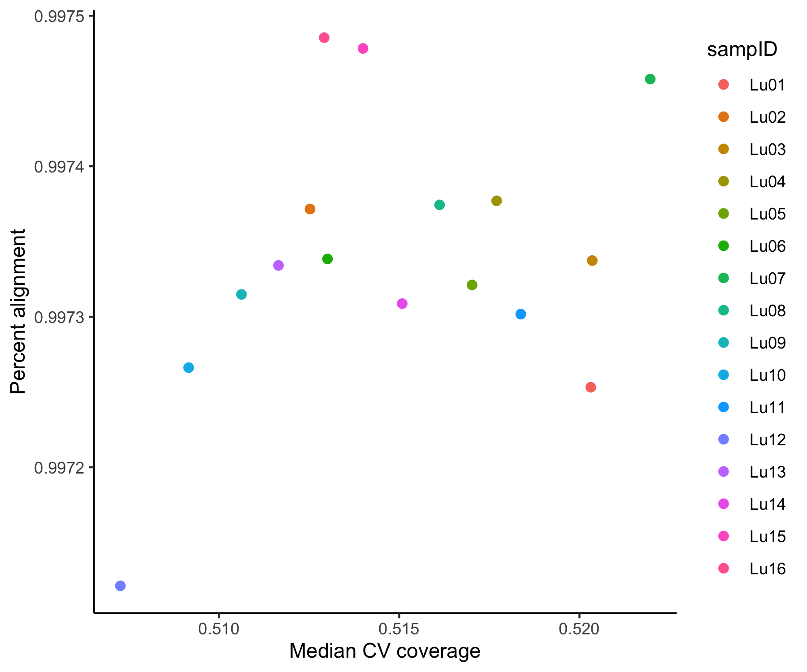

# Pipeline overview

*Command line tools*

1. Combine `.fastq.gz` files per read per sample
2. Remove sequencing adapters
3. Quality filter sequences
4. Align to reference genome
5. Quality filter alignments
6. Count reads in genes

*R*

7. Filter protein coding genes
8. Filter low coverage samples
9. Filter PCA outliers
10. Filter rare genes
11. Normalize counts

# RNA-seq data cleaning
## 1. Combine files

Samples were sequenced as 50 bp paired-end reads on a multi-lane Illumina sequencer. Therefore, there are multiple files for each sample and read. These are combined by sample and read (R1, R2) using the standard Unix function `cat`. The resulting files are in `data_raw/fastq_merge/`

For example:

```{bash eval=FALSE}
cat Lu1*R1_00[0-9].fastq.gz > Lu01_R1.fastq.gz 
cat Lu1*R2_00[0-9].fastq.gz > Lu01_R2.fastq.gz 
```

## 2. Adapters and 3. quality filtering
### Sequence assessment 1

Sequences were assessed using [FastQC](https://www.bioinformatics.babraham.ac.uk/projects/fastqc/) to visualize sequence quality and determine if adapters exist. 

Results can be found in `results/results_fastqc/fastqc_raw/`

For example:

```{bash eval=FALSE}
fastqc Lu01_R1.fastq.gz \
      -o ~/results/results_fastqc/fastqc_raw/ \
      -t 15
```

Resulting in:

{width=49%} {width=49%}

{width=49%} {width=49%}

Results are similar for all samples.

Overall, read quality is high with Phred scores > 30 (upper left), minimal ambiguous bases pairs (upper right), and full length 50 bp reads (lower left).

However, there appear to be adapters present in these reads (lower right). RNA-seq randomly samples pieces of RNA expressed from the genome. Thus, if you stack all reads from a sample, each position should contain roughly 25% of each bp (ACTG). In these samples, we see that the first 15 bp are not at the expected 25%. This most commonly indicates sequencing adapters, because these sequences are the same for all reads, thus skewing the apparent bp proportions. The adapters appear in the results, because pieces of sample DNA are < 50 bp and the machine sequenced past the end of the "real data" into the adapter. The proportions along adapters are not 100%, because there is some variation in sample DNA length that causes the adapters on some sequences to be a few bp shifted relative to other sequences. 

Since the adapters do not represent real biological data, they need to be removed. Also, note that these adapters are not flagged in the "Adapter Content" plot (below), because the FastQC default list does not contain all current Illumina adapter sequences.

{width=49%} 

### Sequence filtering

Using [AdapterRemoval](https://github.com/MikkelSchubert/adapterremoval), sequences are filtered to

* hard cut the 5' end of sequences by 15 bp, thus removing adapters (`trim5p`)
* remove reads with > 1 ambiguous base (`maxns`)
* trim 5' and 3' ends until reach base with quality of 30+ (`trimqualities minquality`)
* remove reads < 15 bp long after both end trimming steps (`minlength`)

Results can be found in `data_raw/fastq_trim/`. Note that this program changes read names from R1 > pair1 and R2 > pair2.

For example: 

```{bash eval=FALSE}
AdapterRemoval \
    --file1 Lu01_R1.fastq.gz \
    --file2 Lu01_R2.fastq.gz \
    --basename data_raw/fastq_trim/Lu01 --gzip \
    --trim5p 15 --maxns 1 --minlength 15 \
    --trimqualities --minquality 30 \
    --threads 15
```

### Sequence assessment 2

Using FastQC again, assess the quality of the filtered reads. Results can be found in `results/results_fastqc/fastqc_trim/`

For example:

```{bash eval=FALSE}
fastqc Lu01.pair1.truncated.gz \
      -o ~/results/results_fastqc/fastqc_trim/ \
      -t 15
```

Resulting in:

{width=49%} {width=49%}

{width=49%} {width=49%}

Results are similar for all samples.

Filtering achieved the desired outcomes as seen in the above plots.

## 4. Alignment

Sequences were aligned to the mouse reference genome ([GRCm38 release 99](https://uswest.ensembl.org/Mus_musculus/Info/Index) aka mm10) using [STAR](https://github.com/alexdobin/STAR). This aligner is optimized for short-read data such as RNA-seq. Therefore, defaults were maintained.

Results can be found in `data_raw/bam`

For example:

```{bash eval=FALSE}
#Download reference
sudo curl -O ftp://ftp.ensembl.org/pub/release-99/gtf/mus_musculus/Mus_musculus.GRCm38.99.gtf.gz
gunzip Mus_musculus.GRCm38.99.gtf.gz

sudo curl -O ftp://ftp.ensembl.org/pub/release-99/fasta/mus_musculus/dna/Mus_musculus.GRCm38.dna.primary_assembly.fa.gz
gunzip Mus_musculus.GRCm38.dna.primary_assembly.fa.gz

#Index reference
STAR --runMode genomeGenerate \
     --genomeDir STARindex.mouse \
     --genomeFastaFiles Mus_musculus.GRCm38.dna.primary_assembly.fa \
     --sjdbGTFfile Mus_musculus.GRCm38.99.gtf \
     --sjdbOverhang 99 \
     --runThreadN 15

#Align
STAR --genomeDir STARindex.mouse \
     --readFilesIn Lu01.pair1.truncated.gz Lu01.pair2.truncated.gz \
     --readFilesCommand zcat \
     --outFileNamePrefix Lu01 \
     --outSAMtype BAM SortedByCoordinate \
     --runThreadN 15 \
     --runRNGseed 8756
     
```

## 5. Alignment filtering
### Alignment assessment

Alignment quality was assessed with [Picard](https://broadinstitute.github.io/picard/) and [samtools flagstat](http://www.htslib.org/doc/samtools-flagstat.html). 

Picard results can be found in `results/results_cleaning/bam.metrics.tsv` and flagstat in `results/results_cleaning/summary.alignment.tsv`.

For example:

```{bash eval=FALSE}
#Download Picard reference
sudo curl -O http://hgdownload.cse.ucsc.edu/goldenpath/mm10/database/refFlat.txt.gz
gunzip -c refFlat.txt.gz > refFlat.mouse.txt
## Remove chr in chromosome name to match ensembl alignment
sed 's/chr//' refFlat.mouse.txt > refFlat.mouse.ensembl.txt

#Assess alignment with Picard
java -XX:ParallelGCThreads=15 \
    -jar picard-2.22.1-0/picard.jar \
    CollectRnaSeqMetrics \
    REF_FLAT=refFlat.mouse.ensembl.txt \
    INPUT=Lu01_Aligned.sortedByCoord.out.bam \
    OUTPUT=results/results_cleaning/bam.metrics.tsv \
    ASSUME_SORTED=true \
    STRAND_SPECIFICITY=NONE \
    MINIMUM_LENGTH=500

#Assess alignment with samtools
samtools flagstat -@ 15 Lu01_Aligned.sortedByCoord.out.bam \
    >> results/results_cleaning/summary.alignment.tsv
```

### Alignment filtering

Alignments were quality filtered using [samtools view](http://www.htslib.org/doc/samtools-view.html) to:

* keep the file header (`h`)
* keep paired reads where both reads mapped to the genome (`-f 3`)
* remove unmapped reads, non-primary alignments, and PCR duplicates (`-F 1284`)
* remove reads with a mapping quality (MAPQ) < 30 (`-q 30`)

See this [explanation of flags](http://broadinstitute.github.io/picard/explain-flags.html) for more details on the numbers used here.

Results can be found in `data_raw/bam_filter_paired`

For example:

```{bash eval=FALSE}
samtools view Lu01_Aligned.sortedByCoord.out.bam \
    -h -f 3 -F 1284 -q 30 \
    -@ 15 \
    > Lu01_filter_paired.bam
```

### Alignment assessment 2

Filtering alignments were then re-assessed with samtools flagstat.

Results can be found in `results/results_cleaning/summary.align.filter.paired.tsv`

For example:

```{bash eval=FALSE}
samtools flagstat -@ 15 Lu01_filter_paired.bam \
    >> results/results_cleaning/summary.align.filter.paired.tsv
```

## 6. Count reads in genes

Total reads in genes were quantified using [SUBREAD featureCounts](http://subread.sourceforge.net/). Only reads in exons of known genes were counted.

Results can be found in `data_raw/counts`

For example:

```{bash eval=FALSE}
featureCounts -T 14 -g gene_id -t exon -p \
  -a Mus_musculus.GRCm38.99.gtf \
  -o Shah.featurecounts.paired.tsv \
  bam_filter_paired/*filter_paired.bam
```

Counts were further formatted using `scripts/RNAseq_counts_formatting.R` to results in `data_clean/Shah.counts.clean.csv`

```{r echo=FALSE, message=FALSE}
library(readr)
read_csv("data_clean/Shah.counts.clean.csv")
```

## Summary 1

See `scripts/RNAseq_summary_formatting.R` for details on plot creation.

**Total sequences retained during cleaning**


**Percent of raw sequences retained during cleaning**


**Final quality**

{width=49%} {width=49%}

Overall, these samples are very high-quality with > 32 million clean, aligned sequences per sample and low variability in gene coverage (*e.g.* median CV coverage). As expected, ~20% of raw sequences were removed for sequence or alignment quality.

A minimum of 15 million sequences were assigned to genes in each sample. This is more than sufficient for desired analyses.


# Further data cleaning in R
## Setup

Load packages

```{r setup, message=FALSE, warning=FALSE}
# Data manipulation and figures
library(tidyverse)
  # Modify ggplot data order within facets
  library(drlib)
  # Plot log scales
  library(scales)
  #Multi-panel figures
  library(cowplot)

# Empirical analysis of digital gene expression data
## Data normalization
library(edgeR)

# Print pretty table to knit file
library(knitr)
library(kableExtra)
  options(knitr.kable.NA = '')
  
#Create 'not in' operator
`%notin%` <- Negate(`%in%`)
```

Set seed

```{r}
set.seed(4389)
```

Set variable names and cutoffs for this workflow.

```{r custom}
# Define cutoffs
#Median CV coverage MAXIMUM
CV.cut <- 0.65
#Alignment percentage with duplicates MINIMUM
align.cut <- 0.8
#Total sequences MINIMUM
count.cut <- 1E6
```

## Read in and format data 
### Counts

```{r}
counts <- read_csv("data_clean/Shah.counts.clean.csv")
```

### Metadata

```{r}
meta <- read_csv("data_clean/Shah.metadata.csv") %>% 
  full_join(read_csv("data_clean/Shah.data.cleaning.metrics.csv"),
            by="sampID") %>% 
  mutate(batch = as.character(batch),
         cell = factor(cell, levels=c("WT","TKO")),
         status = factor(status, levels=c("Uninfected",
                                          "Infected"))) %>% 
  rename(libID=sampID)
```

#### Check samples

*all libraries in the count data are found in the  metadata. And vice versa.*

```{r echo=FALSE}
table(colnames(counts)[-1] == meta$libID,
      meta$libID == colnames(counts)[-1])
```

### Summarize samples

```{r echo=FALSE}
meta %>% 
  group_by(cell, status) %>%
  tally() %>% 

kable(align="l",
      caption="Total libraries") %>% 
  kable_styling(bootstrap_options = "striped", full_width = FALSE)
```

## 7. Filter protein coding genes

Load key. Filter gene key to protein coding (pc) genes that occur in the count data set and have valid MGI symbols. 

```{r eval=FALSE}
#get key
library(biomaRt)
#List all genes in dataset
gene.names <- counts$geneName

#Get mouse reference genome
ensembl <- useEnsembl(biomart = "ensembl", 
                      dataset = "mmusculus_gene_ensembl", 
                      mirror = "uswest")

#Extract key from ref genome
key <- getBM(attributes=c("ensembl_gene_id",
                           "mgi_symbol",
                          "gene_biotype"),
              values=list(gene.names),
              mart=ensembl)

write_tsv(key, path="data_clean/ensembl.key.txt")
```

```{r key, message=FALSE}
key.pc <- read_tsv("data_clean/ensembl.key.txt") %>% 
  rename(geneName=ensembl_gene_id) %>% 
  # Keep only valid MGI symbols
  filter(!is.na(mgi_symbol) & !is.na(geneName)) %>% 
  # Keep protein coding genes only
  filter(gene_biotype == "protein_coding") %>% 
  # Remove duplicate entries
  distinct(geneName, .keep_all=TRUE) %>% 
  # Keep only genes found in dataset count.filter2 
  filter(geneName %in% counts$geneName) %>% 
  arrange(geneName)
```

Filter the count data to pc genes as well.

```{r message=FALSE}
counts.pc <- counts %>% 
  filter(geneName %in% key.pc$geneName) %>% 
  arrange(geneName)
```

#### Check genes

*all genes in the key are found in the data. And vice versa.*

```{r echo=FALSE}
table(key.pc$geneName %in% counts.pc$geneName,
      counts.pc$geneName %in% key.pc$geneName)
```

## 8. Filter low coverage samples
### Assess median CV coverage vs. mapped duplicate reads

Compare the median coefficient of variation (CV) coverage (`median_cv_coverage`) and percent alignment of reads with duplicates (`mapped_reads_w_dups`). Ideally, you want libraries with LOW median CV coverage and HIGH percent aligned duplicates, indicating low variability in coverage over the length of genes and high coverage across the genome, respectively. 

Plot CV coverage vs alignment.

```{r cv.dups, echo=FALSE}
ggplot(meta,
       aes(MEDIAN_CV_COVERAGE, PCT_PF_ALIGNED)) +
           geom_point(size=3) +
  # Add cutoff lines
  geom_hline(yintercept=0.9, linetype=2) +
  geom_vline(xintercept=0.6, linetype=2) +
  #Beautify
  theme_classic() +
  theme(legend.position = "bottom") +
  labs(x="Median CV coverage", y="Mapped reads with duplicates") +
  lims(x=c(0,1), y=c(0,1))
```

### Assess total aligned counts

Assess aligned counts per library. Higher counts indicate high coverage and are preferred. The minimum total sequences cutoff set above is indicated by a horizontal line.

```{r tot.seqs, echo=FALSE, fig.width=8.5}
meta %>% 
    ggplot(aes(x=reorder_within(libID, by=both.align.paired_filter, 
                            within=cell), 
           y=both.align.paired_filter, fill=cell))  +
    geom_col() +
    # Facet by variable of interest
    facet_grid(~cell, scales="free_x", space="free") +
  # Add cutoff line
  geom_hline(yintercept = 1e6) +
  # Beautify
  theme_classic() +
  theme(axis.text.x = element_text(size=rel(0.75),angle = 90, hjust = 1),
        legend.position = "none") +
  labs(x="Sample", y="Total aligned counts\n(Log scale)", fill="") +
  scale_x_reordered() +
  scale_y_continuous(trans = 'log10',
    breaks = trans_breaks("log10", function(x) 10^x),
    labels = trans_format("log10", math_format(10^.x)))
```

### Filter by library coverage

No samples need to be removed.

## 9. Filter PCA outliers
### PCA of variables of interest

If one or more variables of interest represents significant variation in the data, consider further filtering and normalizing separately. This is most common when multiple sample or cell types exist in the data set. 

```{r PCA.all, echo=FALSE, warning=FALSE, fig.width=8.5}
#Calculate PCA for all data.
PCA.all <- counts.pc %>% 
  column_to_rownames("geneName") %>% 
  #Convert to log counts per million
  cpm(., log=TRUE) %>% 
  t() %>% 
  #Calc PCA
  prcomp()

PC1.label <- paste("PC1 (", summary(PCA.all)$importance[2,1]*100, "%)", sep="")
PC2.label <-paste("PC2 (", summary(PCA.all)$importance[2,2]*100, "%)", sep="")

# Extract PC values
PCA.all.dat <- as.data.frame(PCA.all$x) %>% 
  rownames_to_column("libID") %>%
  # Merge with metadata
  full_join(meta, by="libID")

PCA1 <- ggplot(PCA.all.dat,
                  aes(PC1, PC2)) +
           geom_point(aes(color=status),
                      size=3) + 
  #Beautify
  theme_classic() +
  theme(legend.title = element_blank(),
        legend.position = "bottom") +
  labs(x=PC1.label, y=PC2.label, title="Un-normalized logCPM") +
  coord_fixed(ratio=1)

PCA2 <- ggplot(PCA.all.dat,
                  aes(PC1, PC2)) +
           geom_point(aes(color=cell),
                      size=3) + 
  #Beautify
  theme_classic() +
  theme(legend.title = element_blank(),
        legend.position = "bottom") +
  labs(x=PC1.label, y=PC2.label, title="Un-normalized logCPM") +
  coord_fixed(ratio=1) +
  scale_color_brewer(palette="Set1")

PCA3 <- ggplot(PCA.all.dat,
                  aes(PC1, PC2)) +
           geom_point(aes(color=batch),
                      size=3) + 
  #Beautify
  theme_classic() +
  theme(legend.title = element_blank(),
        legend.position = "bottom") +
  labs(x=PC1.label, y=PC2.label, title="Un-normalized logCPM") +
  coord_fixed(ratio=1)+
  scale_color_brewer(palette="Set3")

plot_grid(PCA1, PCA2, PCA3, ncol=3)
```

### PCA of potential outliers

Visualize PCA outliers defined as any library with PC1 and/or PC2 values greater than 3 standard deviations away from the PC mean.

```{r PCA.outlier, echo=FALSE}
PCA.all.sd <- PCA.all.dat %>% 
  #Calculate PC mean std deviation
  summarize(
    PC1.mean = mean(PC1),
    PC1.sd = sd(PC1),
    PC2.mean = mean(PC2),
    PC2.sd = sd(PC2)) %>% 
  #Calculate +/- 3 sd limits
  summarize(
    PC1.min = PC1.mean-(3*PC1.sd),
    PC1.max = PC1.mean+(3*PC1.sd),
    PC2.min = PC2.mean-(3*PC2.sd),
    PC2.max = PC2.mean+(3*PC2.sd))
  
PCA.all.dat <- PCA.all.dat %>%   
  #ID potential outliers
  mutate(col.group = ifelse(PC1 > PCA.all.sd$PC1.max | 
                            PC1 < PCA.all.sd$PC1.min |
                            PC2 > PCA.all.sd$PC2.max | 
                            PC2 < PCA.all.sd$PC2.min, 
                            "potential outlier", "okay"))
PCA.all.dat %>%       
  ggplot(aes(PC1, PC2)) +
  geom_point(aes(color=col.group),size=3) + 
  #Beautify
  theme_classic() +
  theme(legend.title = element_blank(),
        legend.position = "bottom") +
  labs(x=PC1.label, y=PC2.label, 
       title="Un-normalized logCPM") +
  coord_fixed(ratio=1) +
  scale_color_manual(values = c("#969696","#b10026"))
```

### Filter PCA outliers

No PCA outliers exist in the data.

## 10. Filter rare genes
### Create DGEList object

For use in gene filtering with edgeR

```{r dgelist}
dat.pc <- DGEList(
  #count table. move gene names to column names
  counts=as.matrix(column_to_rownames(counts.pc,
                                      "geneName")),
  #metadata
  samples=meta,
  #keep genes in count table
  genes=key.pc)
```

### Filter rare genes

The raw gene sets contain highly variable, low abundance/rare genes.

Filters genes to those with `min.CPM` (counts per million) in at least `min.pct` (percent of samples) or `min.sample` (number of samples).

```{r}
#Get Kim's function from GitHub
source("https://raw.githubusercontent.com/kdillmcfarland/R_bioinformatic_scripts/master/RNAseq_rare_gene_filter.R")

#Filter
rare.gene.filter(dat = dat.pc,
                 min.sample = 3,
                 min.CPM = 0.1,
                 name = "dat.pc.abund")
```

```{r voom1, echo=FALSE, warning=FALSE}
VOI.model <- as.formula("~cell*status")

#RAW
dat.pc.voom <- voomWithQualityWeights(dat.pc, 
     design=model.matrix(VOI.model,
                         data=dat.pc$samples),
     plot=FALSE, save.plot = TRUE)

voom.plot1 <- data.frame(
  x = dat.pc.voom$voom.xy$x, 
  y = dat.pc.voom$voom.xy$y,
  linex = dat.pc.voom$voom.line$x, 
  liney = dat.pc.voom$voom.line$y) %>% 
  
  ggplot() +
  geom_point(aes(x=x, y=y), size=0.5) +
  geom_path(aes(x=linex, y=liney), color="red") +
  theme_classic() +
  labs(x="log2( count size + 0.5 )", y="Sqrt (stdev)",
       title="Raw voom: Mean-variance trend")

#FILTERED
dat.pc.abund.voom <- voomWithQualityWeights(
                     dat.pc.abund,
                     design=model.matrix(VOI.model,
                         data=dat.pc.abund$samples), 
                     plot=FALSE, save.plot = TRUE)

#plot mean-var trend
voom.plot2 <- data.frame(
  x = dat.pc.abund.voom$voom.xy$x, 
  y = dat.pc.abund.voom$voom.xy$y,
  linex = dat.pc.abund.voom$voom.line$x, 
  liney = dat.pc.abund.voom$voom.line$y) %>% 
  
  ggplot() +
  geom_point(aes(x=x, y=y), size=0.5) +
  geom_path(aes(x=linex, y=liney), color="red") +
  theme_classic() +
  labs(x="log2( count size + 0.5 )", y="Sqrt (stdev)",
       title="Filtered voom: Mean-variance trend")

plot_grid(voom.plot1, voom.plot2, ncol=2)
```

```{r echo=FALSE}
#Count genes removed
genes <- nrow(dat.pc$genes)
genes.abund <- nrow(dat.pc.abund$genes)
```

This removes `r genes-genes.abund` (~ `r round((genes-genes.abund)/genes*100, digits=0)`%) genes. 

## 11. Normalize counts
### Normalize for RNA composition

Calculate factors to scale library sizes.

```{r norm}
dat.pc.abund.norm <- calcNormFactors(dat.pc.abund)
```

### Normalize with voom

```{r voom3}
dat.pc.abund.norm.voom <- voomWithQualityWeights(
                          dat.pc.abund.norm,
                          design = model.matrix(VOI.model,
                                 data=  dat.pc.abund.norm$samples),
                          plot=TRUE)
```

### Re-check for PCA outliers

```{r PCA.final, echo=FALSE, warning=FALSE, fig.width=8.5}
#Calculate PCA for voom norm data.
PCA.voom <- as.data.frame(dat.pc.abund.norm.voom$E) %>% 
  t() %>% 
  #Calc PCA
  prcomp()

PC1.label <- paste("PC1 (", summary(PCA.voom)$importance[2,1]*100, "%)", sep="")
PC2.label <-paste("PC2 (", summary(PCA.voom)$importance[2,2]*100, "%)", sep="")

# Extract PC values
PCA.voom.dat <- as.data.frame(PCA.voom$x) %>% 
  rownames_to_column("libID") %>%
  # Merge with metadata
  full_join(as.data.frame(dat.pc.abund.norm.voom$targets),
            by="libID")

PCA1 <- ggplot(PCA.voom.dat,
                  aes(PC1, PC2)) +
           geom_point(aes(color=status),
                      size=3) + 
  #Beautify
  theme_classic() +
  theme(legend.title = element_blank(),
        legend.position = "bottom") +
  labs(x=PC1.label, y=PC2.label, title="voom normalized logCPM") +
  coord_fixed(ratio=1)

PCA2 <- ggplot(PCA.voom.dat,
                  aes(PC1, PC2)) +
           geom_point(aes(color=cell),
                      size=3) + 
  #Beautify
  theme_classic() +
  theme(legend.title = element_blank(),
        legend.position = "bottom") +
  labs(x=PC1.label, y=PC2.label, title="voom normalized logCPM") +
  coord_fixed(ratio=1) +
  scale_color_brewer(palette="Set1")

PCA3 <- ggplot(PCA.voom.dat,
                  aes(PC1, PC2)) +
           geom_point(aes(color=batch),
                      size=3) + 
  #Beautify
  theme_classic() +
  theme(legend.title = element_blank(),
        legend.position = "bottom") +
  labs(x=PC1.label, y=PC2.label, title="voom normalized logCPM") +
  coord_fixed(ratio=1)+
  scale_color_brewer(palette="Set3")

plot_grid(PCA1, PCA2, PCA3, ncol=3)
```

## Summary 2

No samples were removed due to low quality or coverage. In total, `r genes-genes.abund` (~ `r round((genes-genes.abund)/genes*100, digits=0)`%) genes were removed due to low abundance.

# Save data

Write as RData

```{r}
#Rename to short form
dat.voom <- dat.pc.abund.norm.voom

save(dat.voom, file="data_clean/Shah.clean.RData")
```

Write counts as table.

```{r}
#Counts table
as.data.frame(dat.pc.abund.norm.voom$E) %>% 
  rownames_to_column("geneName") %>% 
write_csv("results/gene_level/Shah_gene_voom_counts.csv")
```

# R session

```{r}
sessionInfo()
```

***